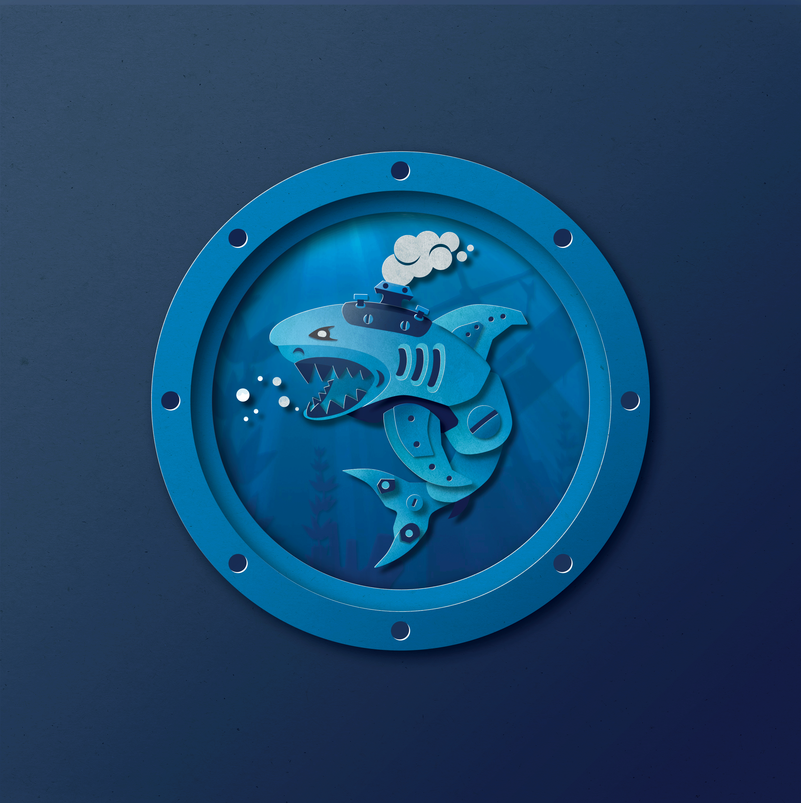
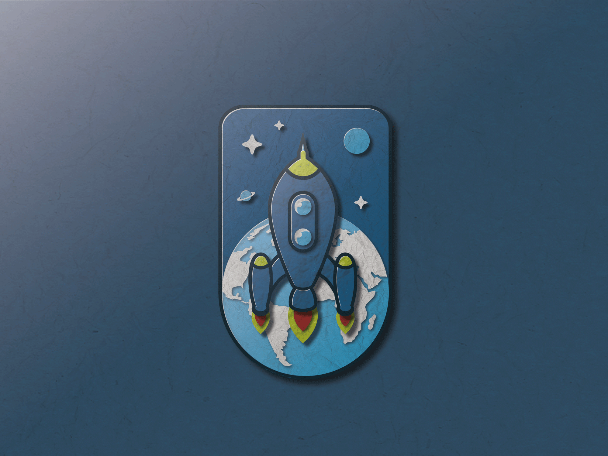
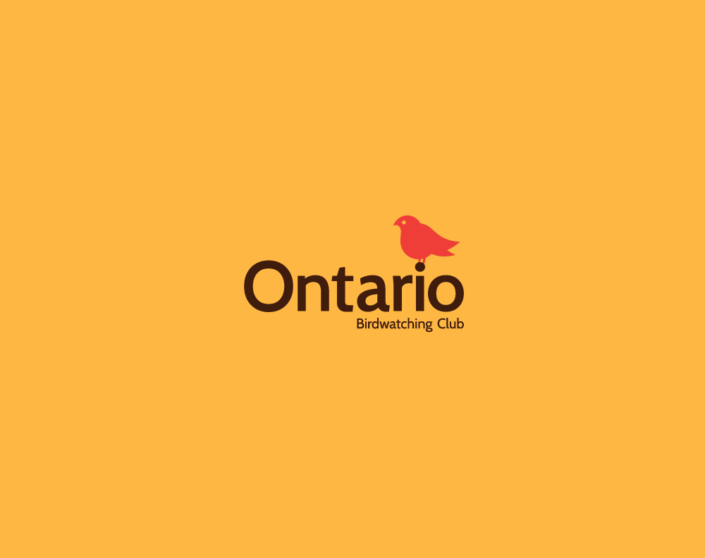

    I made these illustrations a long time ago, the shark was to be invited to dribbble, 
    I used Illustrator, and then I put the textures, lights and shadows in Photoshop,
    following the paper-pop-up style of <a href="https://www.instagram.com/fugstrator/">Michael Fugoso</a>

